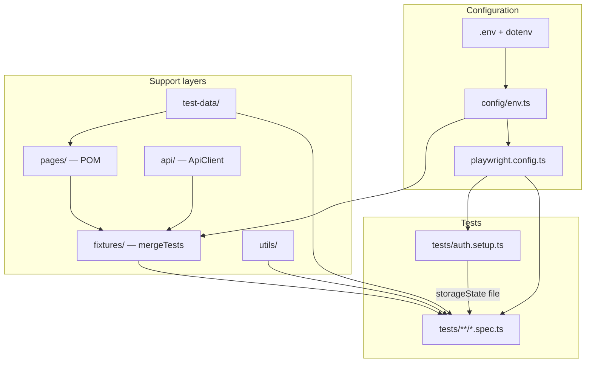

# Playwright TypeScript Test Framework — Overview for Leadership

**Purpose:** This document explains the structure, capabilities, and operating model of the `playwright-ts` automation framework so engineering leads can assess maturity, ownership, and rollout plans.

**Audience:** Engineering leads, QA leadership, platform/DevOps stakeholders.

---

## 1. Executive summary

| Topic | Summary |
|--------|---------|
| **Stack** | [Playwright Test](https://playwright.dev/) with **TypeScript**, **Node.js**, and **npm** scripts. |
| **Pattern** | **Page Object Model (POM)** for UI, **custom fixtures** for shared setup, **API client** wrapper on Playwright’s request context. |
| **Environments** | Multi-environment via **`TEST_ENV`** / **`.env`**; UI and API base URLs configurable independently. |
| **Auth reuse** | Global **storage state** (saved session) after a dedicated **setup** project—reduces repeated logins in stable flows. |
| **Quality gates** | Parallel execution, retries on CI, HTML + list reporters, traces on first retry, strict TypeScript. |
| **CI** | GitHub Actions workflow installs browsers and runs the full suite; HTML report uploaded as an artifact. |

**Demo vs production:** Parts of the suite target **Sauce Demo** (public third-party site) to illustrate patterns. Production adoption should point **`BASE_URL` / `API_BASE_URL`** at controlled environments and replace demo data with your own **test-data** and **page objects**.

---

## 2. High-level architecture

**Flow in words:** Configuration loads environment variables, then Playwright runs a **setup** project that performs login (for the configured demo) and writes **storage state**. Browser projects (**Chromium, Firefox, WebKit**) depend on setup and load that state. Specs import a merged **`test`** from **`fixtures`**, which injects **page**, **page objects**, and **API client** as needed.

---

## 3. Repository layout

| Path | Role |
|------|------|
| **`tests/`** | All automated tests and global setup. Organized by feature or app (`docs/`, `sauce-demo/`, `api/`). |
| **`tests/auth.setup.ts`** | Authentication setup: logs in once (per run), saves **`playwright/.auth/user.json`**. |
| **`pages/`** | Page Object Model: locators and actions per screen (`BasePage`, `HomePage`, `LoginPage`). |
| **`fixtures/`** | Composable Playwright fixtures (`mergeTests`): **API**, **Home**, **Login** page objects. |
| **`api/`** | **`ApiClient`** wrapping **`APIRequestContext`** (HTTP without browser). |
| **`config/`** | Environment resolution, timeouts, paths, Playwright **projects** factory, **dotenv** loader. |
| **`test-data/`** | Routes, presets, app constants (e.g. Sauce Demo), **JSON-driven** scenarios where applicable. |
| **`utils/`** | Shared helpers (waits, app-specific expectations). |
| **`playwright.config.ts`** | Entry config: reporters, metadata, global **`use`**, **projects**. |
| **`tsconfig.json`** | TypeScript + path aliases (`@config`, `@fixtures`, `@pages`, `@api`, `@test-data`, `@utils`). |
| **`.github/workflows/playwright.yml`** | CI: install, **`playwright install --with-deps`**, run tests, upload HTML report. |

---

## 4. Configuration and environments

### 4.1 Environment variables

| Variable | Purpose |
|----------|---------|
| **`BASE_URL`** | Primary UI base URL (wins over profile defaults). |
| **`API_BASE_URL`** | API base for **`ApiClient`**; if unset, falls back to **`BASE_URL`**. |
| **`TEST_ENV`** or **`ENV`** | Named profile: `default`, `local`, `staging`, `production` (see `config/environments.ts`). |
| **`RETRIES`** | Explicit retry count; if unset, CI uses **2**, otherwise profile/local rules apply. |
| **`CI`** | When set, enables stricter behavior (e.g. **`forbidOnly`**, retries, single worker in config). |

### 4.2 Dotenv

- **`config/load-env.ts`** loads **`.env`** from the project root.
- **`playwright.config.ts`** imports **`./config/load-env`** first so **`./config`** sees populated **`process.env`**.

### 4.3 Timeouts and expectations

- **`config/constants.ts`**: navigation and default **expect** timeout.
- **`playwright.config.ts`**: wires **`expect.timeout`** and **`navigationTimeout`** globally.

---

## 5. Playwright projects and auth

### 5.1 Projects (`config/playwright.projects.ts`)

| Project | Behavior |
|---------|-----------|
| **`setup`** | Runs only **`auth.setup.ts`** (Chromium). Produces **`playwright/.auth/user.json`**. |
| **`chromium` / `firefox` / `webkit`** | Depend on **`setup`**, then run all specs with **`storageState`** pointing at that file. |

This pattern follows [Playwright’s recommended auth setup](https://playwright.dev/docs/auth) using project dependencies.

### 5.2 Opting out of saved session

Login UI tests use **`sauceDemoTestUse.withoutStoredAuth`** (empty storage) so they always exercise the real login form. Inventory-style tests use **`withStoredAuth`** to reuse the session.

---

## 6. Page Object Model (`pages/`)

| Class | Responsibility |
|-------|------------------|
| **`BasePage`** | Shared **`page`**, **`goto(path, options?)`** with optional Playwright goto options. |
| **`HomePage`** | Example locators for documentation-style smoke tests. |
| **`LoginPage`** | Label/role-based locators; **`login(..., { waitForPostLoginUrl })`** ties submit + navigation to reduce flakiness. |

**Principle:** Prefer **accessible selectors** (`getByRole`, `getByLabel`) over brittle CSS, unless the product lacks accessibility hooks.

---

## 7. Fixtures (`fixtures/`)

Fixtures are composed with **`mergeTests`** from `@playwright/test`:

| Fixture module | Injected value |
|----------------|----------------|
| **`api.fixture.ts`** | **`api`**: **`ApiClient`** bound to **`env.apiBaseURL`**. |
| **`home.fixture.ts`** | **`homePage`**: **`HomePage`**. |
| **`login.fixture.ts`** | **`loginPage`**: **`LoginPage`**. |

**Consumption:** Specs use **`import { test, expect } from '@fixtures'`** so all merged fixtures are available. Individual layers can be imported as **`apiTest`**, **`homeTest`**, **`loginTest`** for slimmer test bundles if needed.

---

## 8. API testing (`api/`)

- **`ApiClient`** wraps Playwright’s **`request`** fixture (**`APIRequestContext`**).
- Resolves relative paths against **`API_BASE_URL`** (or UI base URL).
- Supports **`get` / `post` / `put` / `patch` / `delete`**, default header merging, **`withHeaders()`** for tokens, and raw **`context`** for advanced calls.

**Note:** The default API context does **not** share browser cookies; for UI+API flows that need the same session, use Playwright patterns that pass **storage state** into a request context (see [API testing](https://playwright.dev/docs/api-testing)).

---

## 9. Test data and data-driven tests

- **`test-data/`** centralizes routes, environment helpers (**`authTestUsePresets`**, **`EMPTY_STORAGE_STATE`**), and app-specific bundles (e.g. **`sauce-demo.ts`**).
- **JSON-driven example:** **`test-data/sauce-demo/login-scenarios.json`** plus **`login-scenarios.ts`** loader; **`login.spec.ts`** iterates rows for parameterized login cases.

**Leadership takeaway:** Non-engineers can extend coverage by adding JSON rows (with review); types are enforced at the loader boundary.

---

## 10. Utilities (`utils/`)

Cross-cutting helpers (e.g. **`waitForPageReady`**, **`expectSauceDemoProductCatalog`**) keep specs short and assertions consistent.

---

## 11. Reporting, debugging, and operations

| Mechanism | Detail |
|-----------|--------|
| **Reporters** | Console **list** + **HTML** report under **`playwright-report/`**. |
| **HTML open policy** | **`never`** on CI; **`on-failure`** locally (configurable). |
| **Traces** | **`trace: 'on-first-retry'`** — captures context when a retried test fails. |
| **Metadata** | Report includes **`test-env`**, **`baseURL`**, **`apiBaseURL`**. |
| **Artifacts (CI)** | Workflow uploads **`playwright-report/`** (e.g. 30-day retention). |

**Local commands (from `package.json`):**

- **`npm test`** — full suite  
- **`npm run test:headed`** — headed browsers  
- **`npm run test:ui`** — Playwright UI mode  
- **`npm run typecheck`** — TypeScript without emit  

---

## 12. CI/CD (GitHub Actions)

The workflow **`.github/workflows/playwright.yml`**:

1. Checks out the repository.  
2. Sets up Node (LTS).  
3. Runs **`npm ci`**.  
4. Installs browsers with **`npx playwright install --with-deps`**.  
5. Runs **`npx playwright test`**.  
6. Uploads the HTML report as an artifact (even on partial failure where appropriate).

**Recommendation for leads:** Require passing checks on default branch; treat the HTML artifact as the first stop for triage.

---

## 13. Security and hygiene

| Topic | Practice |
|-------|-----------|
| **Secrets** | **`.env`** is gitignored; use secrets managers or CI variables for real credentials. |
| **Auth file** | **`playwright/.auth/user.json`** is gitignored; generated per run/clone. |
| **Demo credentials** | Sauce Demo uses **public** demo users—never use real passwords in JSON or code. |

---

## 14. Extensibility checklist (for your product)

1. Set **`BASE_URL`** / **`API_BASE_URL`** to staging or ephemeral environments.  
2. Add **page objects** under **`pages/`** and wire new fixtures if needed.  
3. Replace or supplement **Sauce Demo** specs with **`tests/<your-app>/`**.  
4. Point **auth setup** at your real login flow and adjust **URL patterns** / **storage** path if required.  
5. Expand **JSON** (or typed factories) for data-heavy forms and API payloads.  
6. Tune **retries**, **workers**, and **timeouts** per environment stability.

---

## 15. Known limitations and risks

| Risk | Mitigation |
|------|------------|
| **External demo (Sauce Demo)** | Flakiness and rate limits; move to **owned** environments for critical path. |
| **Third-party network** | Variable latency; navigation tied to **`waitForURL` + click** and sensible **`waitUntil`** on **`goto`**. |
| **Storage state scope** | Saved state is **origin-specific**; multi-domain apps may need multiple setup projects or explicit API auth. |

---

## 16. Document control

| Item | Value |
|------|--------|
| **Repository** | `playwright-ts` |
| **Primary config** | `playwright.config.ts` |
| **This overview** | `FRAMEWORK-OVERVIEW.md` (living document—update when structure or policies change) |

---

*End of framework overview.*
